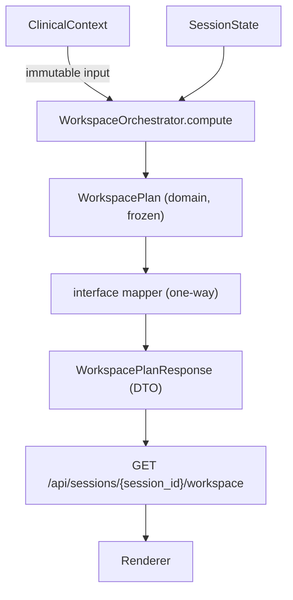

# Doctor Workspace API Contract

- **Status:** Proposed (canonical API contract specification)
- **Date:** 2026-07-28
- **Audience:** Backend, frontend, product, QA
- **Related:** [Doctor Workspace Orchestration](doctor-workspace-orchestration.md), [Doctor Workspace Presentation Contract](doctor-workspace-presentation.md), [ADR 0001: Clinical Artifacts Aggregate](../adr/0001-clinical-artifacts-aggregate.md), [MIGRATION.md](../../MIGRATION.md)

---

## 1. Purpose

This document defines the **API boundary** between the Doctor Workspace Orchestration layer and its consumers (renderer, audit, developer tooling). It specifies request/response contracts, DTO separation from domain objects, workspace versioning, error contracts, and the identity/permission boundary.

The API exposes **orchestration outputs only**. It does not expose `ClinicalContext`, clinical reasoning, or raw patient data. The renderer receives directives; it never computes priority, order, visibility, or size.

### What this document is NOT

| Not in scope | Rationale |
|--------------|-----------|
| UI design or React components | Renderer is a separate concern |
| `WorkspaceOrchestrator` implementation | Domain logic is specified in the orchestration doc |
| Auth implementation | Contract defines obligations; existing JWT/session RBAC is reused |
| `ClinicalContext` changes | Source aggregate is frozen |
| Clinical reasoning | API carries orchestration directives only |
| Persistence of `WorkspacePlan` | Plans are computed on demand; no new tables |

---

## 2. API Boundary

### 2.1 Placement in the clinical spine

```
ClinicalContextBuilder.build
        ↓
ClinicalContext                    # immutable source aggregate (never serialized)
        ↓
WorkspaceOrchestrator.compute      # pure function
        ↓
WorkspacePlan                      # frozen domain artifact
        ↓
interface/mappers.py               # one-way domain → DTO
        ↓
WorkspacePlanResponse              # wire contract
        ↓
GET /api/sessions/{session_id}/workspace
        ↓
Renderer (future)
```



### 2.2 Boundary rules

1. **Orchestrator is a pure function.** The API adds transport, identity, versioning, and serialization — nothing else.
2. **No layout input.** No endpoint accepts layout, priority, ordering, or visibility from the client.
3. **`ClinicalContext` is never mutated** and never serialized through this boundary.
4. **Orchestration outputs only.** Responses contain `WorkspacePlan` projections, not raw intake, chat, or clinical aggregates.
5. **Explainability is write-only.** `VisibilityReason`, queue `explanation`, and `DecisionTrace` are emitted alongside decisions; they never feed back into orchestration.
6. **State, not error.** Pipeline immaturity (`Loading`, `Generating`) returns `200` with an appropriate `workspace_state`; never `4xx`/`5xx`.

---

## 3. Endpoints

Router: `APIRouter(prefix="/api/sessions", tags=["workspace"])`, consistent with existing session routes in `backend/app/api/pdf.py`.

All endpoints require authentication via `Depends(get_current_user)`. Integer `session_id` in path. Snake_case JSON on the wire.

### 3.1 Endpoint table

| Method | Path | Purpose | Side effects | Auth |
|--------|------|---------|--------------|------|
| `GET` | `/api/sessions/{session_id}/workspace` | Compute and return workspace plan | None (`claim=False`) | Doctor, Admin |
| `POST` | `/api/sessions/{session_id}/workspace/acknowledgements` | Record P0 acknowledgement; return recomputed plan | Writes acknowledgement; claims session (`claim=True`) | Doctor, Admin |
| `POST` | `/api/sessions/{session_id}/workspace/story/refresh` | Physician-requested story regeneration | Regenerates story; claims session (`claim=True`) | Doctor, Admin |
| `GET` | `/api/sessions/{session_id}/workspace/trace` | Return `DecisionTrace` for debugging | None (`claim=False`) | Doctor, Admin (settings-gated) |

**Patient principals receive `403` on all workspace endpoints.** The workspace is clinician-facing.

### 3.2 `GET /api/sessions/{session_id}/workspace`

Compute and return the current `WorkspacePlan` for a session.

**Query parameters:**

| Parameter | Type | Default | Description |
|-----------|------|---------|-------------|
| `lens` | string | `general_medicine` | Specialty lens (see orchestration §10) |
| `role` | string | `doctor` | Role profile (see orchestration §11) |
| `offline` | boolean | `false` | Client connectivity signal; when `true`, returns frozen last plan |

**Request headers:**

| Header | Required | Description |
|--------|----------|-------------|
| `Authorization` | Yes | Bearer JWT |
| `If-None-Match` | No | Previous `plan_etag`; returns `304 Not Modified` if plan unchanged |

**Response headers:**

| Header | Description |
|--------|-------------|
| `ETag` | Current `plan_etag` value |
| `X-Contract-Version` | DTO wire contract version (e.g. `1.0.0`) |

**Response:** `200 OK` with `WorkspacePlanResponse` body, or `304 Not Modified` (no body).

**Side effects:** None. Uses `get_authorized_session(..., claim=False)`.

### 3.3 `POST /api/sessions/{session_id}/workspace/acknowledgements`

Record physician acknowledgement of a P0 object. Returns the recomputed plan with updated review state.

**Request headers:**

| Header | Required | Description |
|--------|----------|-------------|
| `Authorization` | Yes | Bearer JWT |
| `If-Match` | Yes | Current `plan_etag`; prevents stale writes |

**Request body:** `AcknowledgementRequest`

**Response:** `200 OK` with updated `WorkspacePlanResponse`.

**Errors:** `409 WORKSPACE_PLAN_STALE` if `If-Match` does not match; `409 WORKSPACE_OBJECT_NOT_ACKNOWLEDGEABLE` if object is not P0 or not in queue; `409 WORKSPACE_READ_ONLY` if session is locked.

**Side effects:** Writes acknowledgement to review state; claims session (`claim=True`); audit record via `record_audit`.

### 3.4 `POST /api/sessions/{session_id}/workspace/story/refresh`

Physician-requested story regeneration per orchestration §7.8.

**Request headers:**

| Header | Required | Description |
|--------|----------|-------------|
| `Authorization` | Yes | Bearer JWT |
| `If-Match` | Yes | Current `plan_etag` |

**Request body:** Empty object `{}`.

**Response:** `200 OK` with updated `WorkspacePlanResponse` (story may change).

**Errors:** `409 WORKSPACE_PLAN_STALE`; `409 WORKSPACE_READ_ONLY`.

**Side effects:** Regenerates story from current context; claims session (`claim=True`); audit record.

### 3.5 `GET /api/sessions/{session_id}/workspace/trace`

Return `DecisionTrace` for debugging and observability. **Not physician-facing by default.**

**Query parameters:** Same as §3.2 (`lens`, `role`, `offline`).

**Response:** `200 OK` with `DecisionTraceResponse`.

**Errors:** `404 WORKSPACE_TRACE_DISABLED` when trace endpoint is disabled via settings.

**Side effects:** None. Trace never appears in the default plan payload (§3.2).

### 3.6 Explicitly NOT in the contract

| Excluded | Rationale |
|----------|-----------|
| `PUT` / `PATCH` on the plan | Plan is computed, not edited |
| Layout override endpoints | Renderer implements directives; it does not set them |
| Priority override endpoints | Priority is orchestrator-owned |
| Queue reorder endpoints | Queue order is deterministic |
| Client-supplied visibility | Visibility is orchestrator-owned |
| Raw `ClinicalContext` serialization | Source aggregate stays backend-only |
| Bulk workspace endpoints | One session per request |

---

## 4. Request/Response Contracts

### 4.1 `WorkspacePlanResponse`

Top-level response for plan endpoints.

| Field | Wire type | Nullable | Source |
|-------|-----------|----------|--------|
| `contract_version` | string | No | API constant (e.g. `"1.0.0"`) |
| `session_id` | integer | No | `WorkspacePlan.session_id` |
| `workspace_state` | string | No | `WorkspacePlan.workspace_state` |
| `layout_directives` | `LayoutDirectiveDTO[]` | No | `WorkspacePlan.layout_directives` |
| `decision_queue` | `DecisionQueueItemDTO[]` | No | `WorkspacePlan.decision_queue` |
| `story` | `ClinicalStoryDTO` | Yes | `WorkspacePlan.story` |
| `pin_zone` | string[] | No | `WorkspacePlan.pin_zone` |
| `cognitive_budget` | `CognitiveBudgetDTO` | No | `WorkspacePlan.cognitive_budget` |
| `metadata` | `PlanMetadataDTO` | No | `WorkspacePlan.metadata` |
| `plan_etag` | string | No | Computed (see §5) |

**Note:** `decision_trace` is **not** included in this response. Use the trace endpoint (§3.5).

**`workspace_state` values:** `loading`, `generating`, `verified`, `partially_verified`, `conflict_present`, `review_needed`, `completed`, `read_only`, `offline` (snake_case wire form of orchestration enum).

### 4.2 `LayoutDirectiveDTO`

| Field | Wire type | Nullable | Source |
|-------|-----------|----------|--------|
| `object_id` | string | No | `LayoutDirective.object_id` |
| `priority` | string | No | `LayoutDirective.priority` (`p0`, `p1`, `p2`, `p3`) |
| `slot` | string | No | `LayoutDirective.slot` |
| `size` | string | No | `LayoutDirective.size` |
| `pinned` | boolean | No | `LayoutDirective.pinned` |
| `trust` | `TrustDescriptorDTO` | No | `LayoutDirective.trust` |
| `flags` | string[] | No | `LayoutDirective.flags` |
| `visibility_reason` | string | Yes | `LayoutDirective.visibility_reason` (required when `slot = hidden`) |

**Renderer rule:** Directives with `slot: "hidden"` must not be rendered. They are included in the payload for explainability and audit.

### 4.3 `TrustDescriptorDTO`

| Field | Wire type | Nullable | Source |
|-------|-----------|----------|--------|
| `primary_provenance` | string | No | `TrustDescriptor.primary_provenance` |
| `all_provenance` | string[] | No | `TrustDescriptor.all_provenance` |
| `confidence` | number | Yes | `TrustDescriptor.confidence` (`null` when domain value is `"unknown"`) |
| `verification` | string | No | `TrustDescriptor.verification` |
| `evidence_refs` | string[] | No | `TrustDescriptor.evidence_refs` |

### 4.4 `DecisionQueueItemDTO`

| Field | Wire type | Nullable | Source |
|-------|-----------|----------|--------|
| `rank` | integer | No | Queue item rank (contiguous from 1) |
| `object_id` | string | No | Queue item `object_id` |
| `reason_code` | string | No | Queue item `reason_code` |
| `explanation` | string | No | Queue item `explanation` (deterministic) |
| `acknowledge_required` | boolean | No | Derived from P0 + flags |

### 4.5 `CognitiveBudgetDTO`

| Field | Wire type | Nullable | Source |
|-------|-----------|----------|--------|
| `primary_count` | integer | No | `cognitive_budget.primary_count` |
| `expanded_count` | integer | No | `cognitive_budget.expanded_count` |
| `deferred_count` | integer | No | `cognitive_budget.deferred_count` |

### 4.6 `ClinicalStoryDTO`

| Field | Wire type | Nullable | Source |
|-------|-----------|----------|--------|
| `text` | string | No | `ClinicalStory.text` |
| `confidence` | number | Yes | `ClinicalStory.confidence` |
| `evidence_refs` | string[] | No | `ClinicalStory.evidence_refs` |
| `stale` | boolean | No | `true` when source facts changed since generation |

### 4.7 `PlanMetadataDTO`

| Field | Wire type | Nullable | Source |
|-------|-----------|----------|--------|
| `context_hash` | string | No | `metadata.context_hash` |
| `lens` | string | No | `metadata.lens` |
| `role` | string | No | `metadata.role` |
| `computed_at` | string (ISO-8601 UTC) | No | `metadata.computed_at` |
| `workspace_plan_version` | string | No | `metadata.workspace_plan_version` |
| `generated_at` | string (ISO-8601 UTC) | No | `metadata.generated_at` |
| `generated_by` | string | No | `metadata.generated_by` |
| `compute_duration_ms` | integer | No | `metadata.compute_duration_ms` |

### 4.8 `AcknowledgementRequest`

| Field | Wire type | Nullable | Description |
|-------|-----------|----------|-------------|
| `object_id` | string | No | `ClinicalObjectId` to acknowledge |

### 4.9 `DecisionTraceResponse`

| Field | Wire type | Nullable | Source |
|-------|-----------|----------|--------|
| `session_id` | integer | No | Session identifier |
| `trace_version` | string | No | `DecisionTrace.trace_version` |
| `steps` | `DecisionTraceStepDTO[]` | No | `DecisionTrace.steps` |
| `plan_etag` | string | No | ETag of the plan this trace was computed with |

### 4.10 `DecisionTraceStepDTO`

| Field | Wire type | Nullable | Source |
|-------|-----------|----------|--------|
| `object_id` | string | No | `DecisionTraceStep.object_id` |
| `step_label` | string | No | `DecisionTraceStep.step_label` |
| `priority_before` | string | Yes | `DecisionTraceStep.priority_before` |
| `priority_after` | string | No | `DecisionTraceStep.priority_after` |
| `detail` | string | No | `DecisionTraceStep.detail` |

### 4.11 Serialization rules

| Rule | Detail |
|------|--------|
| Timestamps | ISO-8601 UTC with `Z` suffix (e.g. `2026-07-28T14:30:00Z`) |
| Unknown confidence | Domain `"unknown"` → wire `null` |
| Domain tuples | Serialized as JSON arrays; order preserved |
| Hidden directives | **Included** in `layout_directives` with `visibility_reason`; renderer must not render them |
| Queue ranks | Contiguous from 1 within role cap (5–8 items depending on role) |
| Enum wire form | Lowercase snake_case (e.g. `general_medicine`, `p0`, `no_data`) |
| Empty arrays | Present as `[]`, never omitted |
| Null story | `story: null` when hidden or insufficient evidence |

---

## 5. DTO Separation from Domain Objects

### 5.1 File placement (future implementation)

```
backend/app/modules/workspace/
├── domain/
│   ├── enums.py          # ClinicalObjectId, PriorityLevel, VisibilityReason, etc.
│   └── models.py         # WorkspacePlan, LayoutDirective, DecisionQueue, etc.
├── application/
│   └── workspace_orchestrator.py
└── interface/
    ├── dto.py            # WorkspacePlanResponse, LayoutDirectiveDTO, etc.
    └── mappers.py        # domain → DTO (one-way)

backend/app/api/workspace.py   # router
```

### 5.2 Separation rules

| Rule | Detail |
|------|--------|
| **One-way mapping** | `domain → DTO` only; no DTO→domain conversion |
| **Frozen domain** | Domain models use `ConfigDict(frozen=True)`, mirroring `ClinicalContext` |
| **DTOs re-declare enums** | Wire enums are string literals in DTOs; domain enums are not imported into DTO layer |
| **No business logic in DTOs** | DTOs are pure data containers with no methods |
| **Domain refactors don't break wire** | Adding a domain field does not auto-expose it; mapper must opt in |
| **Mapper is the only bridge** | Router calls orchestrator → mapper → response; no direct domain serialization |
| **ClinicalContext never crosses boundary** | Orchestrator reads it; API never serializes it |

### 5.3 Mapping invariants

1. Every field in `WorkspacePlanResponse` has an explicit mapper assignment.
2. Domain-only fields (e.g. internal sort keys) are dropped at the mapper.
3. Wire-only fields (e.g. `contract_version`, `plan_etag`) are added at the mapper.
4. Enum values are normalized to lowercase snake_case at the mapper boundary.

---

## 6. Workspace Versioning Strategy

Three independent version identifiers coexist in every plan response:

| Version | Field | Scope | Example |
|---------|-------|-------|---------|
| **Contract version** | `contract_version` | DTO wire shape | `"1.0.0"` (semver) |
| **Algorithm version** | `metadata.workspace_plan_version` | Orchestration algorithm | `"1.0.0"` |
| **Plan ETag** | `plan_etag` | Specific computed plan instance | `"a3f8c2..."` |

### 6.1 Contract version (`contract_version`)

- Semver string in every `WorkspacePlanResponse`.
- Also emitted as response header `X-Contract-Version`.
- **Additive changes** (new optional fields) → minor bump (e.g. `1.0.0` → `1.1.0`).
- **Breaking changes** (field removal, semantic change) → major bump; old major remains served at prior contract version until sunset.
- Clients must ignore unknown fields (forward compatibility).

### 6.2 Algorithm version (`workspace_plan_version`)

- Set by the orchestrator in `WorkspacePlan.metadata`.
- Enables deterministic replay: same algorithm version + same inputs → same plan (except story cache and timestamps).
- Bumped when priority rules, lens weights, or role profiles change.
- Independent of contract version: algorithm can change without DTO shape change, and vice versa.

### 6.3 Plan ETag (`plan_etag`)

Computed hash over:

```
SHA-256(
  context_hash
  + workspace_plan_version
  + contract_version
  + lens
  + role
  + acknowledgement_state_version
)
```

- Returned in response body (`plan_etag`) and response header (`ETag`).
- Clients send `If-None-Match: {plan_etag}` on `GET` → server returns `304 Not Modified` (no body) when unchanged.
- Mutating endpoints (`acknowledgements`, `story/refresh`) require `If-Match` header → `409 WORKSPACE_PLAN_STALE` on mismatch.

### 6.4 Client compatibility rules

| Rule | Detail |
|------|--------|
| Ignore unknown fields | Forward-compatible parsing |
| Tolerate unknown enum values | Unknown `ClinicalObjectId`, `VisibilityReason`, `reason_code` → skip, never render speculatively |
| No field removal within major | Deprecated fields marked in docs; removed only at major bump |
| Deprecation window | Minimum one minor release between deprecation notice and removal |
| Sunset header | Deprecated endpoints emit `Sunset: {date}` and `Deprecation: true` headers |

---

## 7. Error Contracts

### 7.1 Envelope

All errors use the global envelope from `backend/app/core/error_handler.py`:

```json
{
  "success": false,
  "detail": "WORKSPACE_PLAN_STALE",
  "error": {
    "status_code": 409,
    "message": "WORKSPACE_PLAN_STALE",
    "path": "/api/sessions/42/workspace/acknowledgements",
    "timestamp": "2026-07-28T14:30:00.000000"
  }
}
```

FastAPI/Pydantic validation errors (422) use the default FastAPI validation shape and are **not** wrapped by this envelope.

### 7.2 Machine-readable error codes

| Code | HTTP | When |
|------|------|------|
| `WORKSPACE_ACCESS_DENIED` | 403 | Patient principal, non-owning doctor, or session not found (enumeration-safe via `not_found_as_403=True`) |
| `WORKSPACE_LENS_UNKNOWN` | 422 | Unrecognized `lens` query parameter |
| `WORKSPACE_ROLE_UNKNOWN` | 422 | Unrecognized `role` query parameter |
| `WORKSPACE_OBJECT_UNKNOWN` | 422 | Unrecognized `object_id` in acknowledgement request |
| `WORKSPACE_PLAN_STALE` | 409 | `If-Match` / `If-None-Match` ETag mismatch on mutating endpoint |
| `WORKSPACE_OBJECT_NOT_ACKNOWLEDGEABLE` | 409 | Object is not P0 or not in the decision queue |
| `WORKSPACE_READ_ONLY` | 409 | Session is locked; no mutations permitted |
| `WORKSPACE_TRACE_DISABLED` | 404 | Trace endpoint disabled via settings |
| `WORKSPACE_COMPUTE_FAILED` | 500 | Orchestrator raised an unhandled exception |

### 7.3 Error rules

| Rule | Detail |
|------|--------|
| **State, not error** | `Loading` / `Generating` workspace states return `200` with appropriate `workspace_state`; never `4xx`/`5xx` |
| **No partial plans** | On compute failure, return `500`; never a plan missing required fields |
| **No PHI in errors** | Error messages contain codes and paths only; no patient names, complaints, or clinical content |
| **Deterministic retries** | Identical inputs after a transient `500` produce an identical plan |
| **422 before compute** | Unknown `lens`/`role`/`object_id` fail before orchestrator runs; no plan is computed |

---

## 8. Identity and Permission Boundary

This section defines the **contract** for identity and authorization. It does not implement new auth mechanisms.

### 8.1 Principal

- Authenticated `User` via `Depends(get_current_user)` (JWT Bearer, `sub` = user id).
- Authorization via existing `get_authorized_session` in `backend/app/auth/session_access.py`.

### 8.2 Role separation

Two distinct "role" concepts must not be conflated:

| Concept | Layer | Values | Purpose |
|---------|-------|--------|---------|
| **Auth role** (`UserRole`) | Identity / RBAC | `patient`, `doctor`, `admin` | Who may access the endpoint |
| **Orchestration role** (`RoleProfile`) | Request parameter | `doctor`, `resident`, `nurse`, `emergency`, `telehealth` | How the workspace is composed |

`RoleProfile` is a query/body parameter validated against a permitted set per auth role. It grants **no privilege** — it only selects orchestration behavior.

### 8.3 Access matrix

| Auth role | `GET /workspace` | `POST /acknowledgements` | `POST /story/refresh` | `GET /trace` |
|-----------|-------------------|--------------------------|----------------------|--------------|
| Patient | 403 | 403 | 403 | 403 |
| Doctor (own/unassigned session) | 200 | 200 | 200 | 200 (if enabled) |
| Doctor (other doctor's session) | 403 | 403 | 403 | 403 |
| Admin | 200 (clinician-equivalent) | 200 | 200 | 200 (if enabled) |

Session access follows existing rules: `doctor_may_access_session`, claim-on-open, `single_doctor_mode`.

### 8.4 Contract obligations (not implementation)

| Obligation | Detail |
|------------|--------|
| Audit on open | `record_audit(action="view_workspace", ...)` on first `GET /workspace` per session per doctor per day |
| Claim on mutate | `get_authorized_session(..., claim=True)` on acknowledgement and story refresh |
| No token-derived lens/role | `lens` and `role` come from query parameters, not JWT claims |
| No field-level redaction | All orchestration fields are returned to authorized principals |

### 8.5 Auth non-goals

| Non-goal | Rationale |
|----------|-----------|
| New auth mechanism | Reuse existing JWT + session RBAC |
| Scope/permission model | No OAuth scopes or fine-grained permissions |
| Delegation / break-glass | No "act on behalf of" or emergency override |
| Field-level redaction | Orchestration output is not PHI-redacted at field level |
| Token-derived lens/role | Request parameters only |

---

## 9. Acceptance Criteria

The API contract implementation is correct when:

| # | Criterion |
|---|-----------|
| AC-API-1 | Every `GET /workspace` response validates against `WorkspacePlanResponse` schema; no domain type names appear on the wire |
| AC-API-2 | Identical inputs produce byte-identical response bodies except `metadata.generated_at` and `metadata.compute_duration_ms` |
| AC-API-3 | `plan_etag` in body matches `ETag` response header |
| AC-API-4 | `If-None-Match` with current ETag returns `304 Not Modified` with no body |
| AC-API-5 | Every directive with `slot: "hidden"` includes a non-null `visibility_reason` |
| AC-API-6 | Every queue item includes a non-empty `explanation`; ranks are contiguous from 1 |
| AC-API-7 | `decision_trace` is absent from the default plan response |
| AC-API-8 | Patient principal receives `403` on all workspace endpoints |
| AC-API-9 | Doctor accessing another doctor's assigned session receives `403` |
| AC-API-10 | Unknown `lens` or `role` returns `422` without computing a plan |
| AC-API-11 | `workspace_state: "loading"` and `"generating"` return `200`, not `4xx`/`5xx` |
| AC-API-12 | Stale acknowledgement (`If-Match` mismatch) returns `409 WORKSPACE_PLAN_STALE`; plan is unchanged |
| AC-API-13 | `ClinicalContext` is provably unmutated after any workspace API call |
| AC-API-14 | All error responses conform to the global error envelope |
| AC-API-15 | `contract_version`, `metadata.workspace_plan_version`, and `plan_etag` are present on every plan response |

---

## 10. Non-Goals

| Non-goal | Notes |
|----------|-------|
| UI code | No React, Next.js, or Tailwind |
| Orchestrator implementation | Specified in orchestration doc; implemented separately |
| Endpoint implementation | This doc defines contracts; code comes in a later phase |
| `ClinicalContext` changes | Source aggregate is frozen |
| Clinical reasoning | API carries orchestration directives only |
| Auth implementation | Contract defines obligations; existing mechanisms reused |
| `WorkspacePlan` persistence | Plans computed on demand; no new tables |
| EHR write-back | Out of scope |
| WebSocket / streaming | Polling via ETag is sufficient for MVP |

---

## References

- [Doctor Workspace Orchestration](doctor-workspace-orchestration.md) — behavior specification
- [Doctor Workspace Presentation Contract](doctor-workspace-presentation.md) — DTO → ViewModel renderer rules
- [ADR 0001: Clinical Artifacts Aggregate](../adr/0001-clinical-artifacts-aggregate.md)
- [MIGRATION.md](../../MIGRATION.md) — canonical clinical spine
- `backend/app/core/error_handler.py` — global error envelope
- `backend/app/auth/session_access.py` — session RBAC
- `backend/app/api/pdf.py` — session router convention
