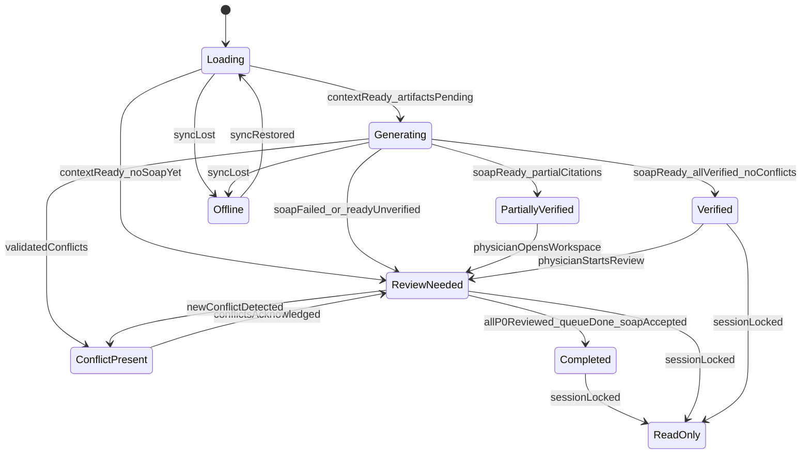

# Doctor Workspace Orchestration Specification

- **Status:** Proposed (canonical behavior specification)
- **Date:** 2026-07-28
- **Audience:** Product, clinical workflow, backend, frontend
- **Related:** [Doctor Workspace API Contract](doctor-workspace-api-contract.md), [Doctor Workspace Presentation Contract](doctor-workspace-presentation.md), [ADR 0001: Clinical Artifacts Aggregate](../adr/0001-clinical-artifacts-aggregate.md), [MIGRATION.md](../../MIGRATION.md)

---

## 1. Purpose

The Doctor Workspace Orchestration layer exists to answer one question for the physician:

> **Where should I look first?**

`WorkspaceOrchestrator` transforms an immutable `ClinicalContext` into a `WorkspacePlan`—a derived artifact that specifies **what appears first**, **what becomes larger or smaller**, **what is hidden**, **what stays pinned**, **what is urgent**, and **what is secondary**.

The orchestrator optimizes:

| Goal | Meaning |
|------|---------|
| Physician attention | Direct gaze to safety-critical and visit-defining information first |
| Cognitive load | Limit simultaneous primary objects; collapse empty and low-value content |
| Safety | Conflicts, allergies, red flags, and critical labs outrank documentation |
| Speed | Deterministic review queue; no layout decisions left to the physician |
| Glanceability | Pin critical items; compress secondary detail; hide absence |

### What this layer is NOT

| Not in scope | Rationale |
|--------------|-----------|
| UI design | Visual presentation is a renderer concern |
| Data model redesign | `ClinicalContext` remains the canonical clinical aggregate |
| Clinical reasoning | No diagnosis, differential, risk scoring, or treatment recommendations |
| API implementation | This document defines behavior only |
| Backend or frontend code | Implementers derive code from this spec in a later phase |

The physician should never think *"Where should I look first?"* The workspace answers that automatically.

---

## 2. Architecture

### 2.1 Placement in the clinical spine

PreVisit's established pipeline:

```
Patient Intake / Chat / Documents
        ↓
ClinicalContextBuilder.build
        ↓
ClinicalContext                    # immutable source aggregate
        ├── TimelineBuilder.build → ClinicalTimeline (derived)
        ├── soap_task → SOAP (derived, persisted)
        └── Future Clinical Artifacts (derived)
```

Orchestration adds a **composition layer** that does not modify `ClinicalContext`:

```
ClinicalContext
        +
SessionState (soap_status, verification_status, offline, review acknowledgements)
        +
OrchestratorInputs (ClinicalSummary red_flags, validated conflicts, role, lens)
        ↓
WorkspaceOrchestrator.compute(context, session_state, lens, role)
        ↓
WorkspacePlan                        # derived orchestration artifact
        ↓
UI Renderer (Doctor / Resident / Nurse / Emergency / Telehealth)
```

Per [ADR 0001](../adr/0001-clinical-artifacts-aggregate.md), `WorkspacePlan` will eventually live at:

```
ClinicalArtifacts.workspace_plan
```

This document does **not** redesign `ClinicalArtifacts`. It only establishes that `WorkspacePlan` is a peer derived artifact alongside `timeline`, future `differential_diagnosis`, `risk_scores`, and `recommendations`.

### 2.2 Repository reality (grounding assumptions)

| Fact | Implication for orchestration |
|------|-------------------------------|
| `ClinicalContext` is backend-only today | `WorkspacePlan` becomes the **first API-facing orchestration contract**; the UI must not re-derive priority from raw Intake/Summary |
| Current clinician UI is a static card stack | `WorkspacePlan` replaces implicit layout with explicit directives |
| `ClinicalTimeline` is built but not consumed by SOAP or UI | Timeline and Story cards are the first intentional downstream consumers |
| Red flags and patient questions live in Intake `ClinicalSummary` | Orchestrator reads them via adapter input, not as first-class `ClinicalContext` fields |
| No `critical_labs` type exists in the data model | Critical lab signal is **derived** by the orchestrator from `lab_evidence` and overview lab text |
| Conflicts are validated `ClinicalDiscrepancy` objects on the SOAP path | `Conflict Present` state keys off validated discrepancies, not raw LLM footer |
| Specialty is prompt-level today (e.g. endocrinology intake) | `SpecialtyLens` is an orchestration overlay only; no specialty enum required in `ClinicalContext` |

### 2.3 Core types

#### ClinicalObjectId

Stable identifier for a workspace card or attention target. The orchestrator operates on a fixed catalog:

| ID | Source in ClinicalContext / adapters |
|----|--------------------------------------|
| `chief_complaint` | `summary.chief_complaint`, Intake `ClinicalSummary` |
| `red_flags` | Intake `ClinicalSummary.red_flags` |
| `critical_alerts` | Composite safety band (conflicts + allergies + red flags + critical labs) |
| `conflicts` | Validated `ClinicalDiscrepancy[]` |
| `allergies` | `overview.allergies` |
| `timeline` | `context.timeline` |
| `story` | Orchestrator-generated narrative (derived) |
| `labs` | `lab_evidence`, `overview.lab_results` |
| `critical_labs` | Orchestrator-derived subset of labs |
| `medications` | `medication_evidence`, `overview.current_medications` |
| `pmh` | `pmh_assertions`, `overview` chronic conditions / surgical / family history |
| `documents` | `file_analyses`, session files |
| `patient_questions` | Intake `ClinicalSummary.patient_questions`, `overview.patient_questions` |
| `missing_data` | Orchestrator-derived gaps (missing CC, allergies unknown, etc.) |
| `soap` | Persisted SOAP + `verification_status` |
| `snapshot` | Demographics / visit metadata summary |

#### PriorityLevel

Objective urgency tier assigned to every `ClinicalObjectId`:

| Level | Name | Meaning |
|-------|------|---------|
| P0 | Critical | Must be seen before any other clinical review; pinned |
| P1 | High | Safety-adjacent or visit-defining; primary attention |
| P2 | Standard | Clinically relevant; normal review band |
| P3 | Deferred | Available but low urgency; compressed or below fold |

#### AttentionSlot

Where an object sits in the physician's attention field:

| Slot | Behavior |
|------|----------|
| `pin` | Never scrolls away; always visible in pin zone |
| `primary` | Above-the-fold primary review band |
| `secondary` | Visible in main scroll; standard prominence |
| `deferred` | Below fold or collapsed; reachable via queue |
| `hidden` | Not rendered; object is empty or irrelevant |

#### SizeHint

How much viewport attention a card receives (abstract units, not pixels):

| Hint | Attention budget | Use |
|------|------------------|-----|
| `expanded` | ≤ 40% of viewport attention units | Safety alerts, unverified SOAP, dense med lists |
| `standard` | ≤ 20% | Default clinical content |
| `compressed` | ≤ 10% | Secondary detail, long timelines |
| `badge` | ≤ 5% | Status-only (e.g. SOAP generating) |

#### TrustProvenance

Multi-valued provenance tag on every card. See [Section 8: Trust Model](#8-trust-model).

#### SpecialtyLens

Named weight overlay that adjusts Decision Queue ordering and size promotion. **Never changes layout structure or hides P0 objects.** See [Section 10: Specialty Lens](#10-specialty-lens).

#### RoleProfile

Named orchestration profile for workspace variants (Doctor, Resident, Nurse, Emergency, Telehealth). Same `ClinicalContext`; different queue, visibility, and story rules. See [Section 11: Role Profiles](#11-role-profiles).

#### DecisionQueue

Ordered list of `{ rank, object_id, reason_code, explanation }` recommending review sequence. See [Section 6: Decision Engine](#6-decision-engine).

Each item includes a deterministic `explanation` string describing why the object occupies that queue position. Explanations contain no clinical recommendations; they are suitable for audit logs, debugging, and future physician tooltips.

#### LayoutDirective

Per-object directive emitted in `WorkspacePlan`:

```
{
  object_id: ClinicalObjectId
  priority: PriorityLevel
  slot: AttentionSlot
  size: SizeHint
  pinned: boolean
  trust: TrustDescriptor
  flags: string[]          // e.g. "show_progression_only", "acknowledge_required"
  visibility_reason: VisibilityReason | null   // required when slot = hidden
}
```

#### VisibilityReason

Explains **why** an object is hidden. Never changes priority; purely an explainability artifact.

| Value | Meaning |
|-------|---------|
| `no_data` | Object has no content to display |
| `specialty_filter` | Role or lens overlay suppresses the object |
| `cognitive_budget` | Primary or expanded card cap forced deferral |
| `physician_dismissed` | Physician acknowledged a P0 alert that is no longer critical |
| `dependency_unavailable` | Prerequisite object absent (e.g. story hidden because timeline empty) |
| `generation_failed` | Derived content failed to generate (e.g. story confidence below threshold) |

When `slot = hidden`, `visibility_reason` must be set. When `slot ≠ hidden`, `visibility_reason` is `null`.

#### DecisionTraceStep

Single priority transition recorded during orchestration:

```
{
  object_id: ClinicalObjectId
  step_label: string          // e.g. "base_priority", "lens_weight", "role_clamp"
  priority_before: PriorityLevel | null
  priority_after: PriorityLevel
  detail: string              // deterministic human-readable note
}
```

#### DecisionTrace

Optional runtime metadata explaining every priority promotion and demotion. Never rendered to physicians by default; intended for debugging, testing, observability, and future developer tooling.

```
{
  trace_version: string       // schema version of the trace format
  steps: DecisionTraceStep[]
}
```

#### WorkspacePlan

Complete orchestration output:

```
{
  session_id: int
  workspace_state: WorkspaceState
  layout_directives: LayoutDirective[]
  decision_queue: DecisionQueue
  story: ClinicalStory | null
  pin_zone: ClinicalObjectId[]
  cognitive_budget: { primary_count, expanded_count, deferred_count }
  decision_trace: DecisionTrace | null
  metadata: {
    context_hash: string
    lens: SpecialtyLens
    role: RoleProfile
    computed_at: datetime
    workspace_plan_version: string
    generated_at: datetime
    generated_by: string
    compute_duration_ms: int
  }
}
```

**Metadata field definitions:**

| Field | Meaning |
|-------|---------|
| `workspace_plan_version` | Version of the orchestration algorithm that produced this plan; enables deterministic replay and future algorithm evolution |
| `generated_at` | UTC timestamp of plan computation |
| `generated_by` | Orchestrator identifier/version (e.g. `workspace-orchestrator@1.0.0`) |
| `compute_duration_ms` | Time spent computing the plan; observability only — never affects orchestration decisions |

The UI renderer **must not** override `priority`, `slot`, `size`, or queue order. It may only render what `WorkspacePlan` specifies.

### 2.4 Orchestrator contract

```
WorkspaceOrchestrator.compute(
  context: ClinicalContext,
  session_state: SessionState,
  lens: SpecialtyLens = GeneralMedicine,
  role: RoleProfile = Doctor,
  review_state: ReviewAcknowledgements = {}
) → WorkspacePlan
```

**Determinism rule:** Given identical inputs, `layout_directives` ordering, `decision_queue`, and `workspace_state` must be identical. The only exception is `story.text`, which is cached by `context_hash` and regenerated only when the hash changes or the physician requests refresh.

---

## 3. Clinical Priority Engine

Priority is computed **per object** using deterministic rules below, then adjusted by Specialty Lens weights, then clamped by Role Profile. Safety objects always outrank documentation.

### 3.1 Per-object rules

#### Chief Complaint (`chief_complaint`)

| Attribute | Rule |
|-----------|------|
| Default | P1 |
| Promote to P0 | Missing or empty → routes to `missing_data` at P0 |
| Promote to P1 | Always P1 when present |
| Demote | Never demoted when present |
| Hidden | Never hidden when present |

#### Red Flags (`red_flags`)

| Attribute | Rule |
|-----------|------|
| Default | P1 |
| Promote to P0 | ≥ 1 red flag present AND (acute presentation OR safety keyword match) |
| Demote | Empty list → `hidden` |
| Slot | P0 → `pin`; P1 → `primary` |

#### Conflicts (`conflicts`)

| Attribute | Rule |
|-----------|------|
| Default | P1 |
| Promote to P0 | ≥ 1 validated high-confidence `ClinicalDiscrepancy` |
| Demote | No validated conflicts → `hidden` |
| Note | Raw LLM conflict footer is ignored; only post-validation discrepancies count |

#### Allergies (`allergies`)

| Attribute | Rule |
|-----------|------|
| Default | P1 when any allergy documented |
| Promote to P0 | Drug allergy present AND (medications present OR allergy keyword in CC) |
| Demote | Empty → P3 compressed in snapshot; not hidden (allergy absence is clinically relevant) |
| Pin | Any documented drug allergy → always in pin zone |

#### Critical Labs (`critical_labs`)

Derived signal—no `ClinicalContext` redesign required.

| Attribute | Rule |
|-----------|------|
| Derivation | Scan `lab_evidence[].extracted_data` and `overview.lab_results[].extracted_data` for critical markers (see 3.2) |
| Default | `hidden` when no labs |
| Promote to P0 | ≥ 1 critical marker detected |
| Promote to P2 | Labs present, none critical → parent `labs` card at P2 |
| Demote | No labs → `hidden` |

#### Labs (`labs`)

| Attribute | Rule |
|-----------|------|
| Default | P2 when any lab present |
| Promote to P1 | Critical labs sub-signal active (via `critical_labs` card) |
| Demote | No labs → `hidden` |

#### Medications (`medications`)

| Attribute | Rule |
|-----------|------|
| Default | P2 when any medication present |
| Promote to P1 | High-risk medication class OR allergy–med interaction OR validated conflict involving medication |
| Size promotion (not priority) | Count > 10 → `expanded`; count ≤ 3 and no high-risk → `compressed` |
| Demote | Empty → `hidden` |

#### Timeline (`timeline`)

| Attribute | Rule |
|-----------|------|
| Default | P2 when `timeline.events` non-empty |
| Promote to P1 | Acute onset < 72h OR `unknown_chronology` count > 2 |
| Demote | Empty events → `hidden` |
| Size | Events > 12 → `compressed` with `show_progression_only` flag |

#### SOAP (`soap`)

| Attribute | Rule |
|-----------|------|
| Default | P2 when `soap_status = ready` |
| Promote to P1 | `verification_status` ∈ {`partially_verified`, `unverified`} OR conflicts present |
| Defer | `soap_status` ∈ {`pending`, `generating`} → slot `deferred`, size `badge` |
| Demote | `soap_status = failed` → P2 with `acknowledge_required` flag |
| Hidden | Never hidden when SOAP exists; badge when generating |

#### Documents (`documents`)

| Attribute | Rule |
|-----------|------|
| Default | P3 when files exist |
| Promote to P2 | OCR-derived data conflicts with patient-reported overview |
| Demote | No files → `hidden` |

#### Snapshot (`snapshot`)

| Attribute | Rule |
|-----------|------|
| Default | P3, always `compressed` |
| Promote to P2 | Telehealth role (identity verification emphasis) |
| Hidden | Never hidden |

#### Story (`story`)

| Attribute | Rule |
|-----------|------|
| Default | P2 when generated |
| Promote to P1 | Never (story supports orientation, does not outrank safety) |
| Demote | Insufficient evidence or confidence < 0.5 → `hidden` |
| Hidden | Timeline empty AND insufficient CC context; Nurse/Emergency roles |

#### Missing Information (`missing_data`)

| Attribute | Rule |
|-----------|------|
| Default | `hidden` |
| Promote to P0 | Required field absent: chief complaint, allergies status unknown, or safety-critical intake gap |
| Slot | P0 → `pin`, size `expanded` |

#### PMH (`pmh`)

| Attribute | Rule |
|-----------|------|
| Default | P3 |
| Promote to P2 | Chronic conditions > 3 OR surgical history relevant to CC keyword |
| Demote | Empty → `compressed` within snapshot, not standalone hidden |

#### Patient Questions (`patient_questions`)

| Attribute | Rule |
|-----------|------|
| Default | P2 when present |
| Promote to P1 | Safety-related keyword in question text |
| Demote | Empty → `hidden` |

### 3.2 Critical lab derivation rules

The orchestrator derives `critical_labs` from lab text using deterministic pattern matching. No new `ClinicalContext` fields.

A lab is **critical** when `extracted_data` or structured value matches any of:

- Explicit critical/high/low flags: `critical`, `panic`, `HH`, `LL`, `***`
- Potassium: value < 2.5 or > 6.0 mEq/L (when parseable)
- Sodium: value < 120 or > 160 mEq/L
- Glucose: value < 50 or > 400 mg/dL
- Hemoglobin: value < 7.0 g/dL
- Troponin: any elevated flag or value above lab-stated upper limit
- INR: value > 5.0
- Any lab where OCR confidence < 0.5 AND value is parseable as abnormal → promote to P1 (not P0) with `unverified` trust

Unparseable lab text with safety keywords (`critical`, `urgent`, `stat`) → P1 with `unverified` trust.

### 3.3 Global promotion and demotion rules

1. **Safety first:** P0/P1 safety objects (conflicts, allergies, red flags, critical labs, missing safety data) always outrank SOAP, story, and documents.
2. **Empty → hidden:** Objects with no content are never rendered as empty cards.
3. **Physician edit lock:** If a physician has edited an object, its trust becomes `physician_edited` and priority cannot be demoted below P2 for that session.
4. **Maximum P0 objects: 3.** If more than 3 objects qualify for P0, retain P0 for the top 3 by safety tie-break order:
   ```
   conflicts > allergies > red_flags > critical_labs > missing_data
   ```
   Excess P0 objects demote to P1.
5. **No priority invention:** The orchestrator assigns priority from rules above; it does not infer clinical urgency beyond defined signals.
6. **Specialty reweighting:** Applied after base priority; see Section 10. Lens never demotes a P0 safety object.
7. **Role clamping:** Applied last; see Section 11. Role never hides P0 safety objects.

### 3.4 Safety-first ordering (tie-break)

When two objects share the same priority tier:

```
conflicts → allergies → red_flags → critical_labs → chief_complaint →
missing_data → timeline → labs → medications → patient_questions →
story → pmh → soap → documents → snapshot
```

---

## 4. Attention Model

### 4.1 Canonical attention flow

Default flow for **General Medicine / Doctor** role:

```
1. Chief Complaint
        ↓
2. Critical Priority Band
   (conflicts → allergies → red flags → critical labs)
        ↓
3. Clinical Story (if present)
        ↓
4. Timeline
        ↓
5. Labs (if present) — else Medications promoted here
        ↓
6. Medications
        ↓
7. Patient Questions / Missing Questions
        ↓
8. SOAP
        ↓
9. Documents / PMH detail (deferred)
```

### 4.2 Why this order

| Step | Rationale |
|------|-----------|
| Chief Complaint first | Orients the physician to *why the patient came* before any detail |
| Safety band second | Conflicts, allergies, red flags, and critical labs can change or halt the visit; must be seen before narrative |
| Story before Timeline | Story conveys *meaning* (problem trajectory); timeline conveys *chronology*. Meaning before raw sequence reduces cognitive integration cost |
| Labs / Meds before questions | Objective and structured data that changes management precedes open patient loops |
| Questions before SOAP | Unanswered patient concerns should be known before the physician endorses AI-generated documentation |
| SOAP last | Documentation is confirmatory, not orienting. Placing SOAP last prevents note-writing from preempting clinical appraisal |
| Documents / PMH deferred | Reference material; available on demand via queue |

### 4.3 Pin zone

The pin zone never scrolls away. It always contains:

1. `chief_complaint` (when present)
2. All current P0 objects (maximum 3)
3. `allergies` chip when any drug allergy is documented (even if allergies card is P1)

Pin zone objects use `slot: pin` and `pinned: true`.

### 4.4 Cognitive load reduction

| Mechanism | Effect |
|-----------|--------|
| Hide empty cards | Eliminates visual noise from absent data |
| Compress secondary content | Timeline > 12 events, snapshot, low med count |
| Cap primary cards at 7 | Forces deferral of lowest-priority visible objects |
| Cap expanded cards at 2 (excluding pin) | Prevents multiple large cards competing for attention |
| Decision queue | Physician follows a single ordered path instead of scanning |
| Badge for generating SOAP | Status without content placeholder |

### 4.5 Review flow

1. Physician opens workspace → `WorkspacePlan` computed → Decision Queue displayed.
2. Physician reviews pin zone (automatic; no scroll required).
3. Physician follows Decision Queue top to bottom.
4. Each P0 object requires explicit acknowledgement before queue advances past it.
5. Acknowledging a P0 object that is no longer P0 (e.g. conflict resolved) collapses it to `standard` size.
6. Queue completion + SOAP acceptance → `Completed` state.

---

## 5. Layout Adaptation Engine

The workspace layout structure (slot positions) is **fixed per role**. Only `size`, `slot`, and `visibility` adapt. The UI renderer applies `LayoutDirective` values; it does not invent layout rules.

### 5.1 Size and slot rules

| Condition | Layout effect |
|-----------|---------------|
| Any P0 object, red flag, or validated conflict | `critical_alerts` band → `expanded`; `timeline` → `compressed`; `soap` → `deferred` lower |
| No labs | `labs` → `hidden`; `medications` → `expanded`; `documents` promotes one attention rank |
| Labs present, none critical | `labs` → `standard`; `medications` → `standard` |
| Medications count > 10 | `medications` → `expanded`; `snapshot` → `compressed` |
| Medications count ≤ 3, no high-risk | `medications` → `compressed` |
| Timeline events > 12 | `timeline` → `compressed`, flag `show_progression_only` |
| Timeline empty | `timeline` → `hidden`; `story` → `hidden` |
| SOAP `generating` | `soap` → `badge`, slot `deferred`; Decision Queue skips SOAP |
| SOAP `ready` + `verified` | `soap` → `standard` |
| SOAP `partially_verified` or `unverified` | `soap` → `expanded`, slot `primary` |
| Validated conflict present | `conflicts` → `expanded` + `pin`; queue inserts conflicts at rank 2 |
| Patient questions empty | `patient_questions` → `hidden` |
| Documents count = 0 | `documents` → `hidden` |
| Missing CC or allergies status unknown | `missing_data` → P0, `expanded`, `pin` |
| Primary card count > 7 | Lowest Decision Queue items → slot `deferred` |
| Expanded card count > 2 (excl. pin) | Lowest-priority expanded card → `standard` |

### 5.2 Expansion and collapse behavior

| Event | Behavior |
|-------|----------|
| Physician focuses a `compressed` card | Promote to `standard` (session-scoped; not persisted in plan until next compute) |
| Physician acknowledges P0 alert | Demote to `standard` if object is no longer P0 |
| Physician leaves focus on expanded card | Remain `expanded` until next `WorkspacePlan` compute |
| New P0 detected on refresh | Re-expand and re-pin regardless of prior acknowledgement |
| Cognitive budget exceeded | Orchestrator pre-emptively defers before render; UI does not decide |

### 5.3 Attention slot assignment

| Slot | Assignment rule |
|------|-----------------|
| `pin` | P0 objects + CC + allergy chip |
| `primary` | P1 objects and unverified SOAP |
| `secondary` | P2 objects |
| `deferred` | P3 objects, generating SOAP, overflow beyond cognitive budget |
| `hidden` | Empty objects, story when insufficient evidence, role-disabled objects |

---

## 6. Decision Engine

The Decision Engine produces a **deterministic recommended review order**. It guides the physician; it does not perform clinical reasoning.

### 6.1 Algorithm

```
1. SEED
   Collect all objects where slot ∈ {pin, primary, secondary} AND size ≠ hidden.

2. SORT (stable, deterministic)
   For each object, compute sort key:
     a. Role clamp order (Emergency/Nurse may suppress objects)
     b. Specialty weight (higher weight → earlier)
     c. Priority level (P0 → P3)
     d. Attention Model default rank (Section 4.1)
     e. Trust uncertainty boost (unverified/confidence < 0.6 → +1 rank within same priority)
     f. ClinicalObjectId alphabetical (final tie-break)

3. GATE
   Insert acknowledge gates: queue cannot advance past rank N until all P0 objects
   at ranks ≤ N are marked reviewed in review_state.

4. EMIT
   Output DecisionQueue: [{ rank, object_id, reason_code, explanation }, ...]
   explanation is generated deterministically from reason_code, object_id, and
   orchestration context; it contains no clinical recommendations.

5. CAP
   Visible queue length ≤ 8. Remainder assigned slot deferred, not shown in queue.
```

### 6.2 Reason codes

| Code | Meaning | Typical objects |
|------|---------|-----------------|
| `SAFETY` | Safety-critical; must review before proceeding | conflicts, allergies, red_flags, critical_labs, missing_data |
| `ORIENT` | Visit orientation | chief_complaint, story |
| `EVIDENCE` | Objective clinical data | timeline, labs, medications |
| `OPEN_LOOP` | Unresolved patient concern | patient_questions, missing_data |
| `DOCUMENT` | Documentation and reference | soap, documents, pmh, snapshot |

### 6.3 Specialty weight application

Specialty Lens provides a multiplier per `ClinicalObjectId` applied to sort key position 2(b). Default multiplier is `1.0`. See Section 10.

### 6.4 Role weight application

Role Profile may suppress objects from the queue entirely (e.g. story for Nurse) or clamp maximum primary count. Suppression does not apply to P0 safety objects.

### 6.5 Trust adjustment

Within the same priority tier, objects with `verification: unverified` or `confidence < 0.6` sort earlier (uncertainty reviewed sooner). Objects with `physician_edited` sort later within the same tier (already human-validated).

### 6.6 Review gates

- Each P0 object in the queue carries flag `acknowledge_required`.
- Workspace state remains `Review Needed` until all P0 objects are acknowledged.
- Acknowledgement is recorded in `review_state` and passed to the next `compute()` call.
- Gates are per-session, not persisted in `ClinicalContext`.

### 6.7 Maximum queue size

**8** visible items. Items ranked 9+ are deferred. The physician can access deferred objects via explicit navigation, but they are not in the recommended queue.

---

## 7. Story Engine

### 7.1 What Story is

**Clinical Story** is a short, evidence-bound narrative that explains *what is going on* with this patient in the context of this visit. It synthesizes meaning from `ClinicalContext` and `ClinicalTimeline`.

Story answers: *"Why is this patient here, and what has changed?"*

### 7.2 What Story is NOT

| Story is NOT | Belongs to |
|--------------|------------|
| Chronology | `timeline` card |
| Diagnosis | Future `differential_diagnosis` artifact |
| Treatment recommendation | Future `recommendations` artifact |
| Risk score | Future `risk_scores` artifact |
| SOAP note | `soap` card |
| Clinical reasoning | Out of scope for orchestration |

### 7.3 Generation rules

Story is generated when **all** of:

- `timeline.events` count ≥ 3 **OR** (chief complaint present AND at least one of: labs, medications, PMH assertions)
- `session_state` does not block generation (not `Offline`)
- Role profile has story enabled (not Nurse, not Emergency)
- No physician freeze on story for this session

Story is **hidden** when:

- Insufficient evidence (conditions above not met)
- Aggregate story confidence < 0.5
- Timeline empty AND no CC
- Role profile disables story

### 7.4 Evidence rules

Every sentence in Clinical Story must map to ≥ 1 evidence reference:

- `TemporalEvidence` from a `TimelineEvent`
- A specific `ClinicalContext` field (e.g. `overview.allergies`, `summary.chief_complaint`)
- A validated `ClinicalDiscrepancy` (mentioned as unresolved only)

Sentences without evidence references are **stripped**, not displayed.

### 7.5 Content rules

| Rule | Detail |
|------|--------|
| No new diagnoses | Do not name conditions not present in context |
| No recommendations | Do not suggest treatment, tests, or referrals |
| No hallucinations | No facts not traceable to evidence refs |
| Uncertainty explicit | Use hedged language when `temporal.uncertainty = true` or confidence < 0.7 |
| Conflicts unresolved | Mention discrepancies as unresolved; do not adjudicate |
| Tense | Present / recent past aligned to visit |

### 7.6 Length limits

| Constraint | Value |
|------------|-------|
| Maximum words | 60 |
| Maximum characters | 400 |
| Maximum sentences | 4 |

### 7.7 Confidence rules

Story confidence = min(evidence confidences) × coverage factor, where coverage factor = (cited facts) / (relevant context facts).

If confidence < 0.5 → story hidden.

### 7.8 Refresh rules

| Event | Behavior |
|-------|----------|
| `ClinicalContext` hash changes | Regenerate story; invalidate cache |
| Physician edits any source fact | Freeze story text; show stale indicator; require explicit refresh |
| Physician requests refresh | Regenerate from current context |
| Session locked (`Read Only`) | Story frozen; no regeneration |

---

## 8. Trust Model

Trust is **clinical provenance behavior**, not a UI theme. Every `LayoutDirective` carries a `TrustDescriptor`.

### 8.1 Provenance tags

| Tag | Source | Examples |
|-----|--------|----------|
| `ai_generated` | LLM output | SOAP body, story, intake clinical summary, HPI summary |
| `patient_reported` | Patient-entered data | Intake demographics, overview, chat messages, HPI answers |
| `document_ocr` | Tesseract OCR path | Lab `extracted_data` from uploaded images |
| `system_derived` | Deterministic computation | Timeline events, validated conflicts, critical lab derivation |
| `physician_edited` | Doctor overwrite | SOAP PATCH, future inline edits |

Tags are multi-valued. `primary_provenance` = highest-trust tag present.

### 8.2 Trust precedence (one truth)

When the same fact appears in multiple sources, canonical value resolves by:

```
physician_edited > document_ocr = system_derived > patient_reported > ai_generated
```

Only the canonical value is displayed. Other sources become expandable evidence refs, not duplicate cards.

### 8.3 Verification states

| State | Meaning |
|-------|---------|
| `verified` | Citation or fact confirmed against source (e.g. RAG similarity ≥ threshold) |
| `partially_verified` | Some citations verified, some not |
| `unverified` | Not confirmed; requires physician review |
| `n/a` | Deterministic or patient-entered data without verification pipeline |

### 8.4 Confidence

Numeric 0.0–1.0 or `unknown`. Sources:

- Timeline event `confidence`
- SOAP citation `similarity_score`
- OCR extraction confidence
- Conflict `confidence` (high/low → 1.0/0.3)

### 8.5 Uncertainty effects on layout

| Condition | Layout behavior |
|-----------|-----------------|
| `confidence < 0.6` OR `verification: unverified` | Size cannot be `compressed` if priority ≥ P2; Decision Queue boosted within tier |
| `document_ocr` only, no patient confirmation | Show provenance; promote one rank if conflicts with `patient_reported` |
| `physician_edited` | Highest trust; AI cannot silently overwrite; sort later in queue |
| `ai_generated` + `unverified` | Size `expanded` if priority ≥ P2 |

### 8.6 Display contract (behavior only)

Every card exposes to the renderer:

```
{
  primary_provenance: TrustProvenance
  all_provenance: TrustProvenance[]
  confidence: float | "unknown"
  verification: "verified" | "partially_verified" | "unverified" | "n/a"
  evidence_refs: string[]     // pointers to source objects
}
```

How the renderer surfaces this (icon, color, label) is a UI concern. The orchestrator only sets the values.

---

## 9. Workspace State Machine

Workspace state is computed from `session_state`, artifact readiness, conflicts, review acknowledgements, and connectivity. It is **not** driven by UI navigation alone.

### 9.1 States

| State | Meaning |
|-------|---------|
| `Loading` | `ClinicalContext` not yet available |
| `Generating` | Context ready; SOAP or derived artifacts still processing |
| `Verified` | SOAP ready, all citations verified, no validated conflicts |
| `Partially Verified` | SOAP ready; some citations unverified |
| `Conflict Present` | ≥ 1 validated `ClinicalDiscrepancy`; review required |
| `Review Needed` | Physician has not completed P0 acknowledgements and/or queue |
| `Completed` | All P0 reviewed, queue done, SOAP accepted |
| `Read Only` | Session locked; no edits |
| `Offline` | Connectivity lost; last plan frozen |

### 9.2 Transition diagram



### 9.3 Transition inputs

| Input | Source |
|-------|--------|
| `soap_status` | `Session.soap_status`: pending, generating, failed, ready |
| `verification_status` | `Summary.soap_verification_status` |
| Validated conflicts | Post-validation `ClinicalDiscrepancy[]` |
| Review acknowledgements | `review_state.acknowledged_objects` |
| Session lock | Session status / claim policy |
| Offline flag | Client connectivity signal |

### 9.4 State effects on WorkspacePlan

| State | Plan behavior |
|-------|---------------|
| `Loading` | Emit empty plan with skeleton directives |
| `Generating` | SOAP as `badge`; queue excludes SOAP |
| `Conflict Present` | Conflicts P0, pinned, expanded |
| `Offline` | Freeze last `WorkspacePlan`; set `Read Only`; no recompute |
| `Read Only` | All directives frozen; no acknowledgement gates |

---

## 10. Specialty Lens

Specialty Lens adjusts **weights only**. It never changes layout structure, slot positions, or hides P0 safety objects.

### 10.1 Lens catalog

#### General Medicine (default)

All weights = 1.0. Attention Model in Section 4.1 is the baseline.

#### Endocrinology

| Object | Weight |
|--------|--------|
| `labs` | 1.5 |
| `critical_labs` | 1.5 |
| `medications` | 1.3 |
| `timeline` (lab progression events) | 1.4 |
| `red_flags` | 1.0 (unchanged) |

#### Cardiology

| Object | Weight |
|--------|--------|
| `red_flags` | 1.5 |
| `timeline` (symptom onset events) | 1.4 |
| `medications` (cardiac classes) | 1.3 |
| `documents` (imaging) | 1.2 |

#### Neurology

| Object | Weight |
|--------|--------|
| `red_flags` | 1.5 |
| `timeline` | 1.4 |
| `patient_questions` | 1.2 |
| `labs` | 0.9 (unless neuro-relevant keyword) |

#### Family Medicine

| Object | Weight |
|--------|--------|
| `patient_questions` | 1.3 |
| `pmh` | 1.2 |
| `medications` | 1.2 |
| `soap` | 1.1 (earlier in queue, not higher priority than safety) |

### 10.2 Lens selection

Lens is an orchestrator input (`SpecialtyLens` enum), not a `ClinicalContext` field. Selection is by physician preference, department config, or visit type—not by redesigning the data model.

---

## 11. Role Profiles

Role Profile adjusts queue composition, story visibility, cognitive budget, and SOAP treatment. Same `ClinicalContext` for all roles.

### 11.1 Doctor (default)

| Setting | Value |
|---------|-------|
| Story | Enabled |
| SOAP | Editable; standard when verified |
| Max primary cards | 7 |
| Max expanded cards | 2 |
| Queue cap | 8 |
| P0 acknowledgement | Required |

### 11.2 Resident

| Setting | Value |
|---------|-------|
| Story | Enabled |
| SOAP | Expanded when unverified (teaching emphasis) |
| Trust uncertainty boost | +1 rank within tier for all unverified objects |
| Max primary cards | 7 |
| Queue cap | 8 |

### 11.3 Nurse

| Setting | Value |
|---------|-------|
| Story | Disabled (hidden) |
| SOAP | Deferred; badge only |
| Elevated objects | allergies, medications, patient_questions, conflicts |
| Chief complaint | Always pinned |
| Max primary cards | 6 |
| Queue cap | 6 |

### 11.4 Emergency

| Setting | Value |
|---------|-------|
| Story | Disabled (hidden) |
| SOAP | Deferred |
| Pin zone | CC + P0 only (no allergy chip unless P0) |
| Timeline | Always compressed |
| Max primary cards | 5 |
| Max expanded cards | 1 |
| Queue cap | 5 |
| Priority boost | red_flags × 1.3, critical_labs × 1.3 |

### 11.5 Telehealth

| Setting | Value |
|---------|-------|
| Story | Enabled |
| Documents | Elevated one rank (identity and visual confirmation) |
| Missing data | Elevated one rank |
| Snapshot | Standard (identity emphasis) |
| SOAP | Standard when verified |
| Max primary cards | 7 |

---

## 12. Global Workspace Rules

1. **One truth.** One canonical value per clinical fact. Trust precedence resolves conflicts.
2. **No duplicated facts.** Each fact has one owning card. Story must not restate full medication lists; `medications` owns meds. Snapshot does not repeat CC verbatim.
3. **Critical never scrolls away.** Pin zone is mandatory for P0 and CC.
4. **Maximum 3 P0 objects.** Excess demotes by safety tie-break order.
5. **Cognitive budget:** ≤ 7 primary cards, ≤ 2 expanded content cards (excluding pin zone).
6. **Maximum card height** is expressed as attention units (Section 2.3), not pixels.
7. **Expansion cap.** At most 2 expanded cards besides pin zone. Orchestrator enforces before render.
8. **Collapse on acknowledgement.** P0 alert acknowledged → `standard` if no longer P0.
9. **Empty → hidden.** Never render placeholder cards for absent data.
10. **Offline behavior.** Freeze last `WorkspacePlan`; state = `Offline` + `Read Only`; no recompute until sync restored.
11. **No invented facts.** Orchestrator assigns priority, order, and visibility only. It does not generate clinical content except Story (which is evidence-bound and separately specified).
12. **UI is not the brain.** Renderer implements `WorkspacePlan`; it does not compute priority, ordering, expansion, visibility, or attention flow.
13. **Deterministic.** Identical inputs → identical `WorkspacePlan` (except cached story text keyed by context hash).
14. **Global explainability.** Every orchestration decision must be explainable. For every object the orchestrator must be able to explain: why it is visible, why it is hidden, why it is pinned, why it was promoted, why it was demoted, and why it appears in its Decision Queue position. Explainability metadata (`VisibilityReason`, queue `explanation`, `DecisionTrace`) must never introduce new clinical facts — it only describes orchestration decisions and never feeds back into priority, slot, size, or queue computation.

---

## 13. Acceptance Criteria

The orchestration implementation is correct when:

| # | Criterion |
|---|-----------|
| AC-1 | Given identical `ClinicalContext`, `session_state`, `lens`, `role`, and `review_state`, `WorkspacePlan` is byte-identical (except story cache metadata) |
| AC-2 | P0 objects are always in pin zone |
| AC-3 | Safety objects (conflicts, allergies, red flags, critical labs) always sort before SOAP and documents in Decision Queue |
| AC-4 | Empty labs → `labs` hidden; empty medications → `medications` hidden |
| AC-5 | Medications count > 10 → `medications` size = `expanded` |
| AC-6 | Medications count ≤ 3, no high-risk → `medications` size = `compressed` |
| AC-7 | Validated conflicts → workspace state = `Conflict Present`; conflicts P0 pinned |
| AC-8 | SOAP `generating` → `badge`, deferred, excluded from queue |
| AC-9 | Specialty lens changes queue order only; layout structure unchanged |
| AC-10 | Role profile changes queue and visibility; does not require `ClinicalContext` changes |
| AC-11 | Story hidden when evidence insufficient; never exceeds length limits |
| AC-12 | Story contains no sentence without evidence ref |
| AC-13 | No duplicate facts across cards in `WorkspacePlan` |
| AC-14 | Primary card count never exceeds role maximum |
| AC-15 | Offline freezes plan; no silent recompute |
| AC-16 | `WorkspacePlan.metadata.workspace_plan_version` is present on every plan |
| AC-17 | Every object with `slot = hidden` exposes a non-null `visibility_reason` |
| AC-18 | Decision Queue `explanation` strings are deterministic for identical inputs |
| AC-19 | `DecisionTrace` reproduces all priority transitions when present |
| AC-20 | `generated_at`, `generated_by`, and `compute_duration_ms` are present in metadata |
| AC-21 | Explainability metadata never changes orchestration behavior (write-only output) |

---

## 14. Non-Goals

This document explicitly does **not** define:

| Non-goal | Notes |
|----------|-------|
| UI design | Colors, typography, components, wireframes |
| React / Next.js / Tailwind | No frontend implementation |
| API endpoints or DTOs | Defined in [`doctor-workspace-api-contract.md`](doctor-workspace-api-contract.md); not in this document |
| `WorkspaceOrchestrator` implementation | No backend code |
| `ClinicalContext` redesign | Source aggregate is frozen |
| `ClinicalArtifacts` package design | Only placement of `workspace_plan` is noted |
| Risk engine | Future artifact |
| Differential diagnosis engine | Future artifact |
| Recommendation engine | Future artifact |
| Clinical decision making | Orchestration guides attention, not treatment |
| EHR write-back | Out of scope |
| New database tables | Out of scope |

---

## 15. Future Evolution

| Phase | Work |
|-------|------|
| Near-term | Implement `WorkspaceOrchestrator` as pure function; expose `WorkspacePlan` via API adapter per [`doctor-workspace-api-contract.md`](doctor-workspace-api-contract.md) |
| Near-term | Replace static `ClinicianDashboard` card stack with `WorkspacePlan`-driven renderer |
| Medium-term | Migrate `WorkspacePlan` to `ClinicalArtifacts.workspace_plan` per ADR 0001 |
| Medium-term | Feed `ClinicalTimeline` to Story Engine and SOAP (timeline already built; consumers are new) |
| Long-term | Lens packs (e.g. emergency chest-pain sub-lens) as weight presets, not layout variants |
| Long-term | Resident teaching telemetry on acknowledgement patterns |
| Long-term | Nurse / Emergency / Telehealth workspace surfaces using same orchestrator |

---

## References

- [Doctor Workspace API Contract](doctor-workspace-api-contract.md)
- [Doctor Workspace Presentation Contract](doctor-workspace-presentation.md)
- [ADR 0001: Clinical Artifacts Aggregate](../adr/0001-clinical-artifacts-aggregate.md)
- [MIGRATION.md](../../MIGRATION.md) — canonical clinical spine
- `backend/app/schemas/clinical_context.py` — `ClinicalContext`
- `backend/app/modules/timeline/domain/models.py` — `ClinicalTimeline`
- `backend/app/schemas/intake.py` — `ClinicalSummary`, `MedicalOverview`
- `backend/app/schemas/pmh.py` — `ClinicalDiscrepancy`, `PMHAssertion`
- `backend/app/services/clinical_conflict.py` — conflict validation
- `backend/app/schemas/medical.py` — `SoapNote`, `VerificationStatus`
