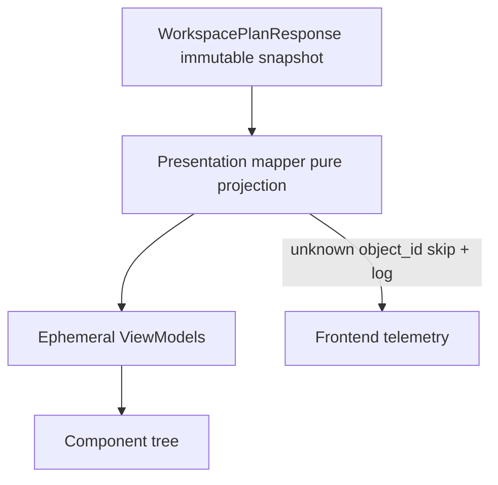
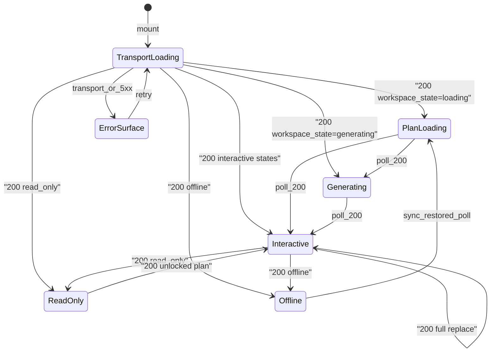

# Doctor Workspace Presentation Contract

- **Status:** Proposed (canonical presentation specification)
- **Date:** 2026-07-29
- **Audience:** Frontend, product, QA, backend (boundary consumers)
- **Related:** [Doctor Workspace Orchestration](doctor-workspace-orchestration.md), [Doctor Workspace API Contract](doctor-workspace-api-contract.md), [ADR 0001: Clinical Artifacts Aggregate](../adr/0001-clinical-artifacts-aggregate.md), [MIGRATION.md](../../MIGRATION.md)

---

## 1. Purpose

This document defines the **Presentation Contract** for the Doctor Workspace: how the future frontend renderer faithfully projects wire DTOs into ephemeral ViewModels and a component tree.

It answers one question:

> **How does the UI faithfully render a `WorkspacePlanResponse` without becoming a second brain?**

Presentation is a **pure projection layer**. It must never contain clinical reasoning, decision prioritization, or workflow orchestration. Those responsibilities remain exclusively in the backend ([orchestration](doctor-workspace-orchestration.md) + [API contract](doctor-workspace-api-contract.md)).

### What this document is NOT

| Not in scope | Rationale |
|--------------|-----------|
| React, Next.js, or component code | Spec only; implementation is a later phase |
| CSS, Tailwind, or visual design tokens | Display mapping is UI-owned at implement time; this doc defines behavior |
| Backend or API changes | Wire contract is frozen in the API contract doc |
| Domain model imports | Presentation never consumes `domain/` types |
| Clinical reasoning / prioritization / orchestration | Backend-only |
| ViewModel persistence or shared ViewModel packages | ViewModels are ephemeral and local to the renderer |
| New endpoints | Use only endpoints defined in the API contract |

---

## 2. Presentation Boundary

### 2.1 Placement in the clinical spine

```
ClinicalContextBuilder.build
        ↓
ClinicalContext                         # never crosses into frontend
        ↓
WorkspaceOrchestrator.compute
        ↓
WorkspacePlan                           # domain; never crosses into frontend
        ↓
interface/mappers.py                    # one-way domain → DTO
        ↓
WorkspacePlanResponse                   # wire DTO (immutable on client)
        ↓
GET /api/sessions/{session_id}/workspace
        ↓
Presentation mapper (pure projection)
        ↓
Ephemeral ViewModels                    # discard on every plan 200
        ↓
Component tree (future React)
```



### 2.2 Boundary rules

1. **DTO-only inbound.** Presentation consumes only wire DTOs from `backend/app/modules/workspace/interface/dto.py`: `WorkspacePlanResponse`, nested DTOs, `AcknowledgementRequest`, `DecisionTraceResponse`.
2. **No Domain.** Presentation must never import, mirror, or share backend `domain/` models or enums as types.
3. **Opaque wire strings.** Enum-like fields are opaque strings. Unknown values are skipped; never render speculatively (API contract forward-compat).
4. **Pure projection.** No clinical reasoning, decision prioritization, or workflow orchestration in Presentation.
5. **UI is not the brain.** Renderer must not recompute priority, slot, size, visibility, or queue order (orchestration rule 12).
6. **Immutable plan.** Treat every successful `WorkspacePlanResponse` as a frozen snapshot. Never mutate DTO fields in place.
7. **Atomic ViewModel replace.** Every successful `200` with a plan body replaces the **entire** ViewModel. Never merge DTO fragments from different ETags.
8. **Ephemeral ViewModels.** ViewModels must not be persisted and must not become shared contracts. They exist only to isolate UI rendering from wire DTOs.
9. **No new endpoints.** Mutations use only `POST .../acknowledgements` and `POST .../story/refresh` as specified in the API contract.
10. **State, not error.** `workspace_state` values `loading` and `generating` are HTTP `200` plan states — never treated as transport errors.

### 2.3 Clean Architecture note

| Layer | Owns |
|-------|------|
| Domain / Application (backend) | Clinical reasoning, priority, slots, queue, story generation, state machine |
| Interface (backend) | Wire DTOs + one-way mappers |
| API (backend) | Transport, auth, ETag headers, error envelope |
| **Presentation (frontend)** | Pure DTO → ViewModel projection, component binding, local chrome, telemetry on unknown cards |

`ClinicalContext` and `WorkspacePlan` (domain) never cross the HTTP boundary. Only Workspace DTOs may cross into the frontend.

---

## 3. Workspace State Machine (Presentation Projection)

Orchestration §9 owns **when** states occur. Presentation owns **how chrome and interactions react** to the wire `workspace_state` string on each immutable plan snapshot.

### 3.1 Wire states → UI modes

| `workspace_state` | UI mode | Interactions allowed |
|-------------------|---------|----------------------|
| `loading` | Skeleton / empty plan | Poll only; no acknowledgement; no story refresh |
| `generating` | Partial plan; SOAP rendered as badge when directive says so | Poll; acknowledgement allowed if plan emits P0 / queue gates |
| `verified` | Full interactive | Ack + story refresh per plan flags |
| `partially_verified` | Full interactive; trust chrome emphasizes partial verification | Ack + story refresh per plan flags |
| `conflict_present` | Full interactive; conflicts expected in pin / primary per directives | Ack + story refresh per plan flags |
| `review_needed` | Full interactive; decision queue emphasized | Ack + story refresh per plan flags |
| `completed` | Full interactive; review complete chrome | Story refresh if stale; ack only if plan still requires it |
| `read_only` | Frozen chrome | No mutations (`POST` disabled) |
| `offline` | Offline banner + frozen last good plan | No mutations; on connectivity restore → resume poll |

Unknown `workspace_state` values: show a generic non-blocking banner, render known directives if present, emit telemetry, do not invent interaction modes.

### 3.2 UI-visible transitions

Transitions are observed via successive GETs and mutation responses — Presentation does not drive the machine.



### 3.3 State effects on rendering

| State | Render behavior |
|-------|-----------------|
| `loading` | Skeleton layout; empty or skeleton directives; no card content required |
| `generating` | Render available non-hidden directives; honor SOAP `badge` / deferred sizing from DTO |
| `conflict_present` | Render conflicts where directives place them (typically pin / expanded); do not invent conflict priority |
| `offline` | Keep last good immutable plan + ViewModel; show offline banner; disable mutations |
| `read_only` | Keep plan; disable acknowledgement and story refresh CTAs |

---

## 4. ViewModels

### 4.1 Lifecycle and contract rules

ViewModels are **ephemeral presentation projections**.

| Rule | Requirement |
|------|-------------|
| Purpose | Isolate UI rendering from wire DTOs |
| Persistence | **MUST NOT** be persisted (no localStorage, IndexedDB, URL, disk, or service worker cache of ViewModels) |
| Shared contracts | **MUST NOT** become shared contracts across packages, services, or API surfaces |
| Lifetime | Discarded and rebuilt on every successful plan `200` |
| Source of truth | The immutable `WorkspacePlanResponse` for the **current ETag only** |

Wire DTOs remain the only cross-boundary contract. ViewModels are renderer-private.

### 4.2 ViewModel shapes (logical)

Shapes below are documentation tables for a future TypeScript implementation — not a shared package schema.

#### `WorkspaceViewModel`

| Field | Source | Notes |
|-------|--------|-------|
| `sessionId` | `session_id` | |
| `workspaceState` | `workspace_state` | Drives chrome (§3) |
| `planEtag` | `plan_etag` / `ETag` header | Prefer header when present |
| `contractVersion` | `contract_version` / `X-Contract-Version` | |
| `pinCards` | directives in `pin_zone` / `slot=pin` | Ordered per `pin_zone` then remaining pins |
| `primaryCards` | `slot=primary` | Exclude hidden |
| `secondaryCards` | `slot=secondary` | |
| `deferredCards` | `slot=deferred` | Collapsed by default |
| `queue` | `decision_queue` | Rank order preserved |
| `story` | `story` | Null → omit StoryCard |
| `cognitiveBudget` | `cognitive_budget` | Display / diagnostics only; do not enforce new limits |
| `metadata` | `metadata` | Lens, role, hashes, timestamps |
| `mutationsAllowed` | derived from state | False for `loading`, `read_only`, `offline` |

#### `CardViewModel`

| Field | Source |
|-------|--------|
| `objectId` | `object_id` |
| `priority` | `priority` |
| `slot` | `slot` (`pin` \| `primary` \| `secondary` \| `deferred` only) |
| `size` | `size` |
| `pinned` | `pinned` |
| `trust` | `TrustViewModel` |
| `flags` | `flags` (known honored; unknown ignored) |

Directives with `slot: "hidden"` are **excluded** from renderable ViewModels. They may remain on the raw immutable DTO for audit/dev tooling only.

#### `TrustViewModel`

| Field | Source | Display rule |
|-------|--------|--------------|
| `primaryProvenance` | `primary_provenance` | Opaque string → display token |
| `allProvenance` | `all_provenance` | |
| `confidence` | `confidence` | `null` → display token `"unknown"` (never coerce to `0`) |
| `verification` | `verification` | |
| `evidenceRefs` | `evidence_refs` | |

How icons/labels surface trust is UI-owned; values are DTO-owned (orchestration §8.6).

#### `DecisionQueueViewModel`

| Field | Source |
|-------|--------|
| `items` | `decision_queue` sorted by `rank` ascending |
| Each item | `rank`, `object_id`, `reason_code`, `explanation`, `acknowledge_required` |

#### `StoryViewModel`

| Field | Source |
|-------|--------|
| `text` | `text` |
| `confidence` | `confidence` (`null` → unknown) |
| `evidenceRefs` | `evidence_refs` |
| `stale` | `stale` |

Present only when `story !== null`.

#### `ErrorViewModel`

| Field | Source |
|-------|--------|
| `code` | Error envelope `detail` / `error.message` |
| `httpStatus` | `error.status_code` |
| `presentation` | Mapped per §8 |

### 4.3 Mapping rules

1. **Hidden skip.** `slot === "hidden"` → not in renderable bands; optional audit/dev retention on raw DTO only.
2. **Pin band.** Order cards by `pin_zone` object ids that have matching non-hidden pin directives; then any remaining `slot=pin` not listed.
3. **Unknown `object_id`.** Skip the card. Log through the **frontend telemetry channel** (event name e.g. `workspace.unknown_object_id`, payload: `object_id`, `session_id`, `plan_etag`, `contract_version`). **Never fail rendering** because of an unknown card. Never invent card content.
4. **Unknown enum-like strings** (`priority`, `size`, `slot` other than known set, flags, reason codes): skip speculative UI; log telemetry; continue.
5. **Ignore unknown JSON fields** on DTOs (forward compatibility).
6. **No merge.** Projection input is exactly one immutable plan snapshot.

### 4.4 ClinicalContentViewModel — Presentation Integration Aggregate

`ClinicalContentViewModel` is an **integration-only composition object**. It is **not** a domain model.

| Rule | Requirement |
|------|-------------|
| Purpose | Group existing feature content ViewModels (`PatientHeaderContent`, `TimelineContent`, `LabsContent`, etc.) for WorkspaceShell composition |
| Business rules | **Owns none** |
| Domain behavior | **Owns none** |
| Composition | Intentionally composed from existing content ViewModels only |
| Future decomposition | May be split into feature-specific content aggregates without changing Presentation contracts — presenters already receive feature slices, never the aggregate |

**Composition boundary:** WorkspaceShell (or an immediate composition helper) selects the appropriate content slice by `object_id` and injects **only that slice** into each Presenter. Presenters must not import or accept `ClinicalContentViewModel`.

### 4.5 Presentation Update Assumptions

| Assumption | Requirement |
|------------|-------------|
| Immutability | Plan ViewModels and clinical content ViewModels are immutable snapshots |
| Full replacement | Presentation expects **full replacement** of both bags on every successful update |
| No patching | Presentation must not patch individual fields onto a prior snapshot |
| No merge | Presentation must not merge fragments from different snapshots or ETags |
| No streaming | Presentation contains no streaming / incremental apply logic |
| Future SSE | SSE (or any push transport) must adapt **outside** Presentation — deliver a full-replace snapshot at the Presentation boundary |

---

## 5. UI Behavior

### 5.1 Must

| # | Behavior |
|---|----------|
| 1 | Render only non-hidden directives from the current plan snapshot |
| 2 | Apply `size` as attention budget: `expanded`, `standard`, `compressed`, `badge` |
| 3 | Keep pin zone fixed (never scrolls away) |
| 4 | Place primary above the fold; secondary in main scroll; deferred collapsed by default |
| 5 | Surface trust on every card from `TrustViewModel` |
| 6 | Render story iff `story !== null`; show stale affordance when `stale === true` |
| 7 | Walk decision queue in `rank` order |
| 8 | Honor `acknowledge_required` exactly as emitted by the plan |
| 9 | Honor known flags: `acknowledge_required`, `show_progression_only` |
| 10 | On every plan `200`, atomically replace the entire ViewModel |

### 5.2 Must not

| # | Behavior |
|---|----------|
| 1 | Recompute priority, slot, size, visibility, or queue order |
| 2 | Hide, reorder, or invent directives client-side |
| 3 | Contain clinical reasoning, prioritization, or orchestration |
| 4 | Persist ViewModels or promote them to shared contracts |
| 5 | Mutate `WorkspacePlanResponse` in place |
| 6 | Merge fields from plans with different ETags |
| 7 | Fail the workspace render on unknown `object_id` |
| 8 | Treat `loading` / `generating` as HTTP errors |
| 9 | Write local focus-expand back to the backend |
| 10 | Call undeclared endpoints |

### 5.3 Local UI state (allowed, non-plan)

Session-scoped **focus expand** (orchestration §5.2): temporarily elevate a compressed card for readability. Rules:

- Stored only as local chrome state (not in ViewModel persistence, not in DTO).
- Cleared on next plan full-replace or when navigating away.
- Never POSTed; never alters `layout_directives`.

### 5.4 Cognitive budget

`cognitive_budget` is informational. Presentation may display diagnostics in dev tooling. It must **not** invent additional hide/collapse rules beyond directives.

---

## 6. Loading Strategy

### 6.1 Transport loading vs plan loading

| Concept | Meaning | UI |
|---------|---------|-----|
| **Transport loading** | No successful plan response yet (in-flight GET, or error with no last good plan) | Full-shell skeleton / spinner |
| **Plan `workspace_state: loading`** | HTTP `200`; pipeline immature; empty/skeleton directives | Skeleton bands; continue polling |
| **Plan `workspace_state: generating`** | HTTP `200`; partial plan | Render available cards; poll |

### 6.2 Initial mount

1. `GET /api/sessions/{session_id}/workspace` with `lens` / `role` query params (defaults: `general_medicine`, `doctor` per API contract).
2. On `200`: freeze DTO snapshot → project entire ViewModel → render.
3. On failure with no prior plan: show `ErrorViewModel` with retry.
4. No WebSocket in MVP; use ETag polling (§7, §9).

### 6.3 Implementation prerequisite (proxy)

The frontend API proxy must forward `ETag`, `If-None-Match`, and `If-Match` between browser and backend. Documented here as an acceptance prerequisite for the future React implementation — **not** changed in this documentation sprint.

---

## 7. Refresh Strategy

| Trigger | Action |
|---------|--------|
| Interval poll while session open | `GET` with `If-None-Match: {plan_etag}` |
| Window focus / visibility restore | Conditional `GET` with `If-None-Match` |
| After successful acknowledgement | Full-replace ViewModel from mutation `200` body + new ETag |
| After successful story refresh | Full-replace ViewModel from mutation `200` body + new ETag |
| Story stale CTA | `POST .../story/refresh` with `If-Match` |
| Offline → online | `GET` without `offline=true`; exit frozen mode on interactive `200` |
| Explicit offline | `GET` with `offline=true` → frozen last plan; read-only UI |
| Lens / role change | New `GET` with new query params; new cache key; full-replace |

### 7.1 Response handling

| HTTP | Presentation action |
|------|---------------------|
| `200` + plan body | Treat body as new immutable snapshot. **Atomically replace entire ViewModel.** Drop any in-flight optimistic UI that assumed the previous ETag. Never merge with prior snapshot. |
| `304 Not Modified` | Keep current immutable plan + ViewModel. Update local “last checked” timestamp only. |
| `409 WORKSPACE_PLAN_STALE` | Discard pending mutation. `GET` fresh plan. Full-replace on `200`. |
| Network / `5xx` | Retry with backoff. If a last good plan exists, keep rendering it with an error banner. |

---

## 8. Error Presentation

Map only codes defined in the API contract. Do not invent new machine codes.

| Code | HTTP | Presentation |
|------|------|--------------|
| `WORKSPACE_ACCESS_DENIED` | 403 | Blocking access-denied surface |
| `WORKSPACE_LENS_UNKNOWN` | 422 | Inline validation on lens control |
| `WORKSPACE_ROLE_UNKNOWN` | 422 | Inline validation on role control |
| `WORKSPACE_OBJECT_UNKNOWN` | 422 | Inline / queue item validation |
| `WORKSPACE_PLAN_STALE` | 409 | Soft conflict: refetch plan; discard pending mutation; full-replace |
| `WORKSPACE_OBJECT_NOT_ACKNOWLEDGEABLE` | 409 | Queue item error; refetch plan; full-replace |
| `WORKSPACE_READ_ONLY` | 409 | Switch chrome to read-only; disable mutations |
| `WORKSPACE_TRACE_DISABLED` | 404 | Dev-only: hide trace panel |
| `WORKSPACE_COMPUTE_FAILED` | 500 | Retryable error surface |
| Network / other 5xx | — | Retry with backoff; preserve last good plan if any |
| FastAPI validation 422 | — | Inline field errors from validation payload |

**Never** treat `workspace_state: loading` or `generating` as errors.

Error surfaces must not include PHI (patient names, complaints, clinical content) beyond what the plan already shows in authorized UI.

---

## 9. ETag / Cache Behavior

Aligned with API contract versioning and ETag rules.

### 9.1 Client obligations

1. Treat each successful plan body as an **immutable snapshot** keyed by `plan_etag`.
2. Store `plan_etag` from body and `ETag` response header; prefer header when both present and disagree only if logging a telemetry warning, then prefer header.
3. Honor `X-Contract-Version`. Unsupported major version → hard fail / upgrade gate (do not partial-render).
4. On `GET`, send `If-None-Match` when an etag is known.
5. On `POST` acknowledgements / story refresh, always send `If-Match` with the current etag.
6. On `409 WORKSPACE_PLAN_STALE`, fetch a fresh plan and **full-replace** the ViewModel.
7. **Never merge DTO fragments from different ETags** (no field-level patching across responses).
8. In-memory cache key: `(session_id, lens, role)` holding at most the current immutable plan + derived ViewModel. Do not mix roles/lenses.
9. Do not persist Domain models or ViewModels.
10. Ignore unknown JSON fields.

### 9.2 What may be remembered

| Allowed in memory | Forbidden |
|-------------------|-----------|
| Current immutable `WorkspacePlanResponse` for active key | Persisted ViewModels |
| Derived ephemeral ViewModel for that same etag | Cross-etag field merges |
| Local focus-expand chrome | Client-invented layout directives |
| Last-checked timestamp | Shared ViewModel npm/package contracts |

---

## 10. Component Hierarchy

Logical tree only — no React, CSS, or Tailwind.

```
WorkspaceShell
├── WorkspaceChrome          # state banner, lens/role context, offline/read-only, errors
├── PinZone                  # never scrolls away
│   └── CardSlot[]           # object_id registry
├── PrimaryBand
│   ├── StoryCard            # optional; only if story ViewModel present
│   └── CardSlot[]
├── SecondaryBand
│   └── CardSlot[]
├── DeferredBand
│   └── CollapsedCardSlot[]  # collapsed by default
├── DecisionQueuePanel
│   └── QueueItem[]          # ack CTA when acknowledge_required
└── TracePanel               # optional / settings-gated / dev
```

### 10.1 Card registry

Presentation owns a registry mapping known wire `object_id` strings to card presenters:

| `object_id` | Presenter responsibility |
|-------------|--------------------------|
| `chief_complaint` | Chief complaint card |
| `red_flags` | Red flags card |
| `critical_alerts` | Critical alerts card |
| `conflicts` | Conflicts card |
| `allergies` | Allergies card |
| `timeline` | Timeline card |
| `story` | Prefer top-level `story` DTO / StoryCard; directive may still appear |
| `labs` | Labs card |
| `critical_labs` | Critical labs card |
| `medications` | Medications card |
| `pmh` | PMH card |
| `documents` | Documents card |
| `patient_questions` | Patient questions card |
| `missing_data` | Missing data card |
| `soap` | SOAP card (often badge while generating) |
| `snapshot` | Snapshot card |

**Layout and attention always come from Workspace DTOs.** Card body content may be loaded from existing clinical APIs where needed; those fetches must not alter slot, size, priority, or queue.

**Unknown `object_id`:** skip card → telemetry (`workspace.unknown_object_id`) → continue rendering remaining cards. Never fail the workspace.

---

## 11. Interaction Model

### 11.1 Acknowledge P0

1. Enabled only when `mutationsAllowed` and the queue/directive emits `acknowledge_required` for that `object_id`.
2. `POST /api/sessions/{session_id}/workspace/acknowledgements` with body `{ "object_id": "..." }` and header `If-Match: {plan_etag}`.
3. Disable CTA while in flight.
4. On `200`: full-replace ViewModel from response body (no merge).
5. On `409`: handle per §8; refetch; full-replace.

### 11.2 Story refresh

1. Available when story is present and (`stale === true` or physician explicitly requests refresh), and mutations allowed.
2. `POST /api/sessions/{session_id}/workspace/story/refresh` with `{}` and `If-Match`.
3. On `200`: full-replace ViewModel.

### 11.3 Decision queue

- Navigate items in ascending `rank` as given by the DTO.
- Gate advance on `acknowledge_required` **exactly as emitted** — do not invent additional gates.
- Selecting a queue item may scroll/focus the corresponding `CardSlot` (local chrome only).

### 11.4 Local focus expand

Temporary size bump for readability. Cleared on plan replace or navigation away. Never written to backend.

### 11.5 Lens / role change

Issue a new `GET` with updated query params. Use a new cache key. Full-replace ViewModel. Never POST layout, priority, or visibility.

### 11.6 Forbidden client interactions

- Client-driven hide / reorder of directives
- Client prioritization or clinical reasoning
- Speculative rendering of unknown cards
- Partial application of a new plan onto an old ViewModel

### 11.7 Trace (optional)

`GET .../workspace/trace` is settings-gated / developer tooling. Trace is **not** part of the default plan payload. On `WORKSPACE_TRACE_DISABLED`, hide the TracePanel.

---

## 12. Future Extension Points

| Extension | Presentation impact |
|-----------|---------------------|
| New `object_id` | Add registry presenter only; no client priority/slot logic |
| New wire fields | Ignore until mapping updated (forward compat) |
| WebSocket / SSE | Optional later; ETag polling remains canonical for MVP |
| `ClinicalArtifacts.workspace_plan` (ADR 0001) | Persistence may move server-side; Presentation still consumes the same DTOs |
| New role / lens values | Query params + chrome labels only; do not invent weights |
| Replace `ClinicianDashboard` | Drive layout exclusively from this contract (orchestration §15) |
| New known flags | Honor when documented; unknown flags remain ignored |

---

## 13. Acceptance Criteria

The Presentation Contract is satisfied when a future implementation meets:

| # | Criterion |
|---|-----------|
| AC-PRES-1 | Inbound types are Workspace wire DTOs only; no backend `domain/` imports |
| AC-PRES-2 | Presentation contains no clinical reasoning, decision prioritization, or workflow orchestration |
| AC-PRES-3 | ViewModels are ephemeral: not persisted; not exported as shared contracts |
| AC-PRES-4 | Every `WorkspacePlanResponse` is treated as immutable on the client |
| AC-PRES-5 | Every successful plan `200` atomically replaces the entire ViewModel |
| AC-PRES-6 | No merge of DTO fragments from different ETags |
| AC-PRES-7 | Directives with `slot: "hidden"` are never rendered |
| AC-PRES-8 | Unknown `object_id` is skipped, logged via frontend telemetry, and never fails rendering |
| AC-PRES-9 | `workspace_state` `loading` / `generating` render as plan states (HTTP 200), not errors |
| AC-PRES-10 | GET uses `If-None-Match` when etag known; mutations use `If-Match` |
| AC-PRES-11 | `304` keeps current ViewModel; `409 WORKSPACE_PLAN_STALE` refetches and full-replaces |
| AC-PRES-12 | Renderer does not recompute priority, slot, size, visibility, or queue order |
| AC-PRES-13 | No new backend endpoints are required or invented |
| AC-PRES-14 | Frontend proxy forwards `ETag`, `If-None-Match`, and `If-Match` (implementation prerequisite) |
| AC-PRES-15 | `confidence: null` displays as unknown, not zero |

---

## 14. Non-Goals

| Non-goal | Notes |
|----------|-------|
| React / Next.js implementation | Spec only |
| CSS / Tailwind / visual design system | Behavior contract only |
| Backend or API contract changes | Frozen for this sprint |
| `ClinicalContext` in the frontend | Never crosses the boundary |
| Client-side priority engine | Orchestrator-owned |
| ViewModel persistence | Forbidden |
| Shared ViewModel packages | Forbidden |
| WebSocket streaming | ETag polling for MVP |
| EHR write-back | Out of scope |

---

## References

- [Doctor Workspace Orchestration](doctor-workspace-orchestration.md) — behavior, state machine, renderer rules
- [Doctor Workspace API Contract](doctor-workspace-api-contract.md) — endpoints, DTOs, ETag, errors
- [ADR 0001: Clinical Artifacts Aggregate](../adr/0001-clinical-artifacts-aggregate.md)
- [MIGRATION.md](../../MIGRATION.md) — canonical clinical spine
- `backend/app/modules/workspace/interface/dto.py` — wire DTOs (`WorkspacePlanResponse`, etc.)
- `backend/app/modules/workspace/interface/mappers.py` — one-way domain → DTO
- `backend/app/core/error_handler.py` — global error envelope
